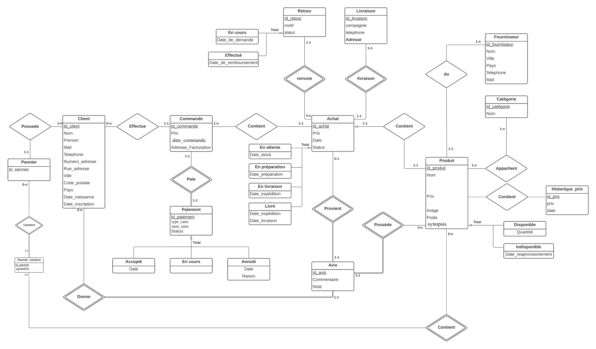

Voici notre modélisation :
===========

## Client

L'entité client contient toutes les informations du client.
Possède une relation avec les entités suivantes :
* Panier
* Commande

## Panier

Contient les informations sur le panier du client.

## Commande

Cette entité contient les informations sur les commandes du client.
Possède une relation avec les entités suivantes :
* Client
* Livraison
* Produit

## Paiement

Information sur le paiement 

## Livraison

Information sur les livraisons

## Produit

Information sur les produits

## Fournisseur

Information sur les fournisseurs

## Avis

Les avis sur les produits

## Catégorie

Catégorie des produits

## PS

Il nous manque à modéliser le retour des produits, remboursement etc...
